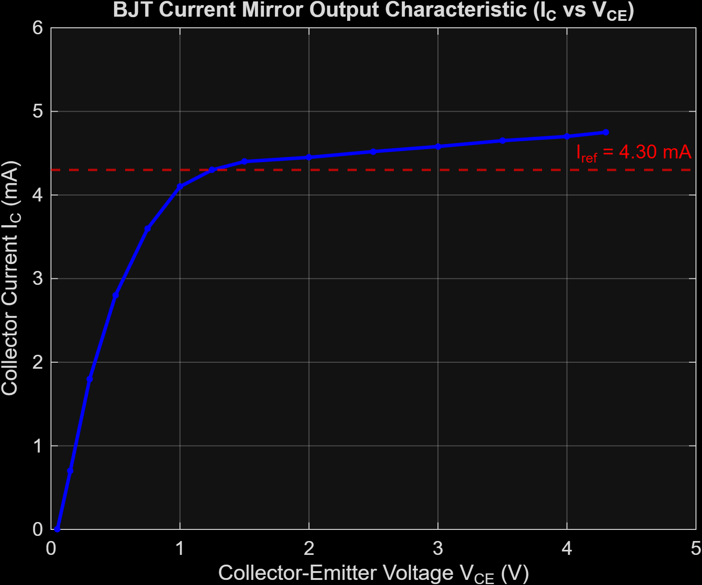
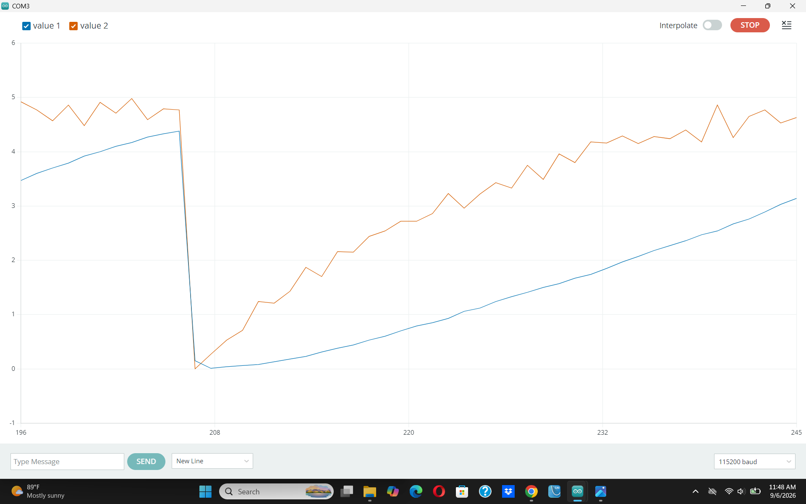
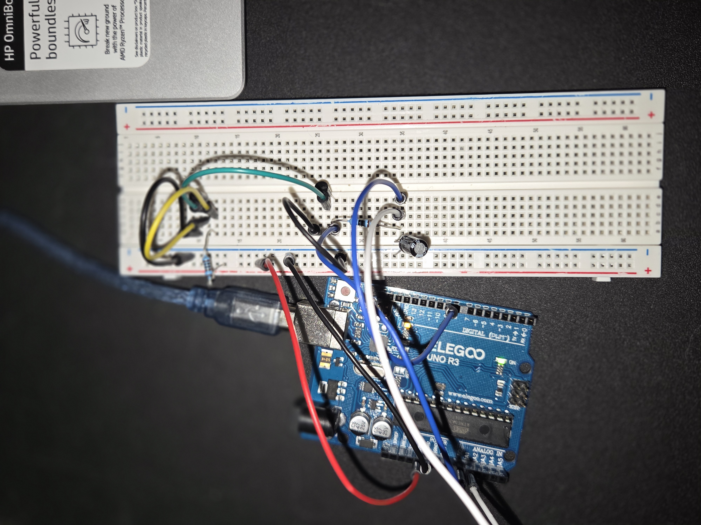
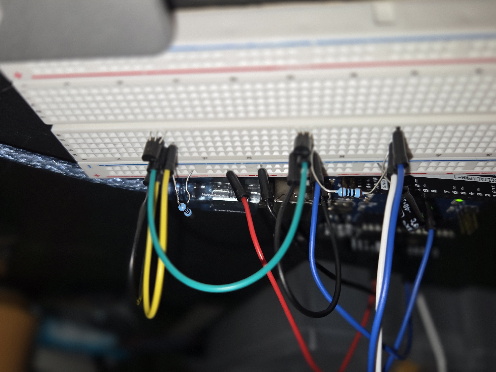
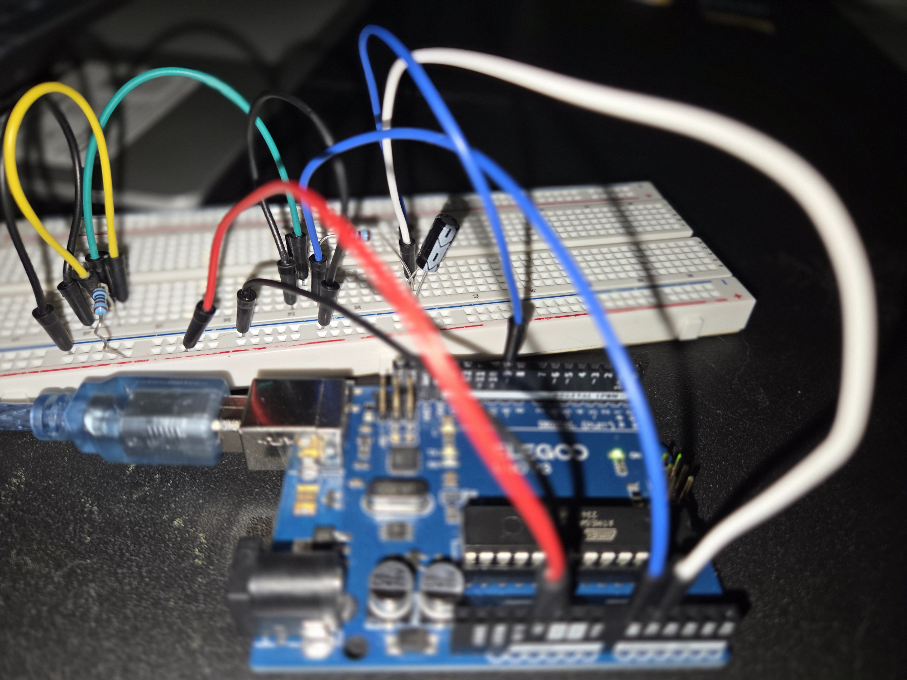

# BJT Current Mirror Characterization

Automated measurement and verification of an active BJT current mirror using an Arduino microcontroller and MATLAB data visualization.

---

## Output Characteristic ($I_C$ vs $V_{CE}$)

* **Reference Current ($I_{ref}$):** Biased at **4.30 mA** via matched reference transistor.
* **Saturation Region ($0\text{ V} < V_{CE} < 0.8\text{ V}$):** Output current ramps sharply as the transistor exits deep saturation.
* **Active Region ($V_{CE} \ge 1.0\text{ V}$):** Regulates a stable collector current mirroring $I_{ref}$.
* **Early Effect ($V_A$):** The slight upward slope across $1.0\text{ V}$ to $4.5\text{ V}$ reflects finite dynamic output resistance.

---

## Real-Time Acquisition

Real-time serial telemetry captured from the Arduino ADC during the filtered PWM voltage sweep across the compliance range.

---

## Hardware Implementation

| Top Overview | Transistor Pair Close-up | Wiring & Measurement Points |
| :---: | :---: | :---: |
|  |  |  |

### Key Circuit Parameters
* **Active Devices:** Matched NPN BJTs
* **Reference Resistor:** $1\text{ k}\Omega$ tied to $5\text{ V}$ rail
* **Sense Resistor ($R_{sense}$):** $100\ \Omega$ (current-to-voltage conversion for ADC)
* **Stimulus:** Low-pass filtered PWM sweep on Arduino Pin 9

---

## Repository Structure

* `bjt_current_mirror.ino` — Arduino sweep generation, ADC sampling, and serial streaming.
* `bjt_plot.m` — MATLAB data processing and visualization script.
* `matlab_bjt_curve.png` — High-resolution exported characteristic plot.
* `Arduino_plotter.png` — Real-time telemetry capture.
* `circuit_setup_*.jpg` — Physical breadboard documentation.
